# Linear Algebra

### There seems to be lot of questions on linear algebra but mostly these are concept overlap questions.
### Infact everything can be solved as linear algebra. 

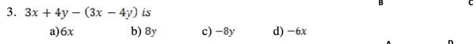

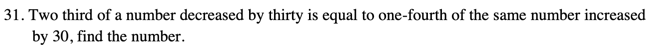

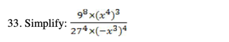

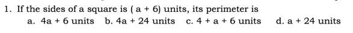

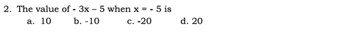

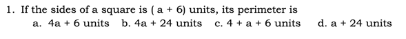

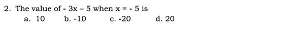

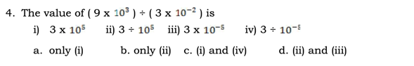

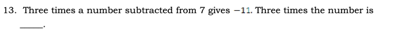

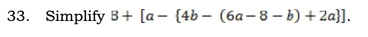

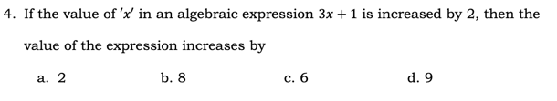

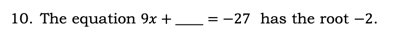

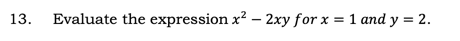

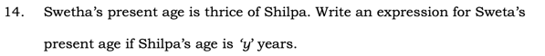

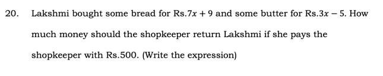

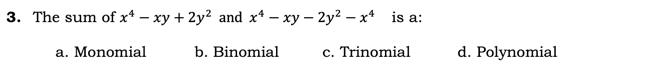

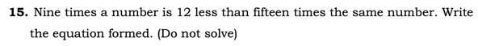

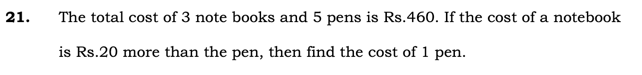

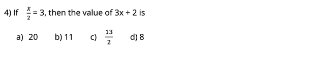

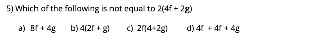

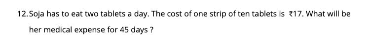

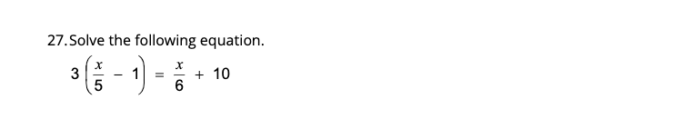

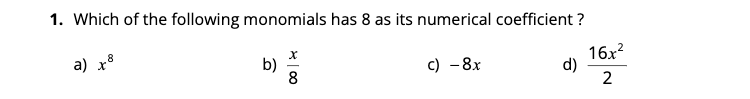

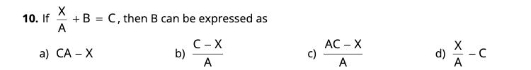

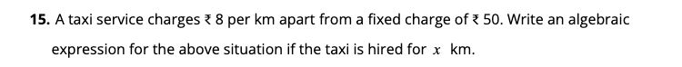

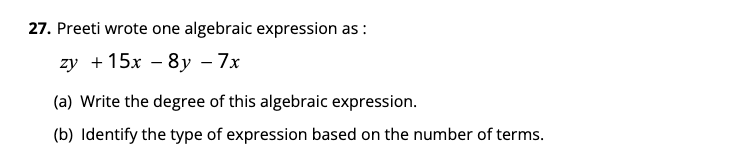

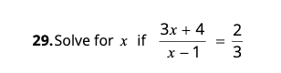

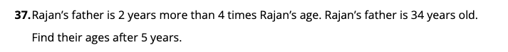

